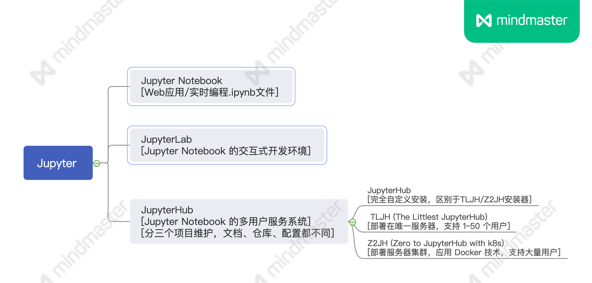

# Jupyter Hub/Lab/Notebook 简介

Jupyter 是一个开源平台，其中包含一套工具，包括：

- Jupyter Notebook：一个基于浏览器的应用程序，可以创建和共享包含实时代码、方程式、可视化和叙述性文本的文档（即 Jupyter Notebook 文件）
- Jupyter Lab：一个基于浏览器的应用程序，可以访问多个 Jupyter Notebook 文件以及其他代码和数据文件
- Jupyter Hub：可以在服务器上运行的多人版 Jupyter Notebook and Lab

我们用的是Lab，写的是Notebook，Hub支持多人使用Lab。

# Jupyter Hub/Lab/Notebook 区别与联系

- JupyterHub 是为多个用户提供 Jupyter Notebook 的集成服务系统，JupyterHub 下用户环境彼此隔离，无法相互共享，每个用户需要单独配置自己的 Python/Conda 环境等。
- JupyterHub 与 Jupyter Notebook/Lab 并非包直接含关系，JupyterHub 初始安装不包含 Jupyter Notebook/Lab，二者甚至不在一台服务器上，需要各自搭建后，通过配置组合在一起。
- JupyterHub、Jupyter Notebook/Lab 分别有自己的仓库、文档、技术栈（如：除 Python、H5 外，JupyterHub 涉及 NodeJS，JupyterLab 涉及 TypeScript）。因此，JupyterHub 与 Jupyter Notebook/Lab 的接口、主题、插件等定制开发也是分别独立的项目范畴。
- JupyterHub 支持第三方 Oath 认证登录，需要另外开发配置。常见的包括 GitHub、GitLab、Google 等（主要针对编程群体，因此不包括 Facebook、Twitter）。
- JupyterHub 下又分为三项目：JupyterHub、TLJH、Z2JH，每个项目都各自的文档系统、Git仓库、环境配置。每个项目的环境搭建方式大概又各可分为 3 种方式：Conda/Pip 安装、Docker 安装、Dev 环境安装。对应到开发，要根据具体需求确定一个方向，搭建配置指定的环境项目。

综上，将 Jupyter 系列产品关系总结如下图：

